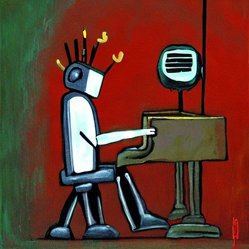

# MUSE



MUSE (Musically Universal Symbolic Encoder) is a music transformer model, pre-trained by doing masked sequence modelling on piano-rolls derived from MIDI. MUSE can be fine-tuned to perform a variety of tasks. Notably it can be fine-tuned to generate MIDI music in any style (given an appropriate dataset). Due to its non-causal nature, it can be used with non-autoregressive Markov Chain Monte Carlo (MCMC) sampling techniques. In the original paper (pre-print not yet available) we use Gibbs sampling to generate prompted fugues and chorales in the style of J.S. Bach. 

If you are interested in fine-tuning MUSE yourself, you should take a look at the informal documentation HOWTO.md. This describes the structure of the codebase, and includes examples of fine-tuning/generating using MUSE. Please note that the project is a work in progress and is subject to change.

Current samples can be found in `samples`. For more information, there will be a blogpost coming soon explaining how everything works in more detail. Feel free to follow me [@loua42](https://twitter.com/loua42) and checkout other generative music on my [soundcloud](https://soundcloud.com/loua19).

### Installation 

I recommend using conda to install the requirements. The following will install MUSE in debian/ubuntu:

```
git clone https://github.com/loua19/muse && cd muse
conda create -n muse python=3.10.8
conda activate muse
make init
```

You can download the pre-trained parameters using gsutil (GCP) using:

```
sudo apt-get gsutil
make maskedlm_params
```

or alternatively if you want the fugue fine-tuned parameters:

```
make fugue_params
```
